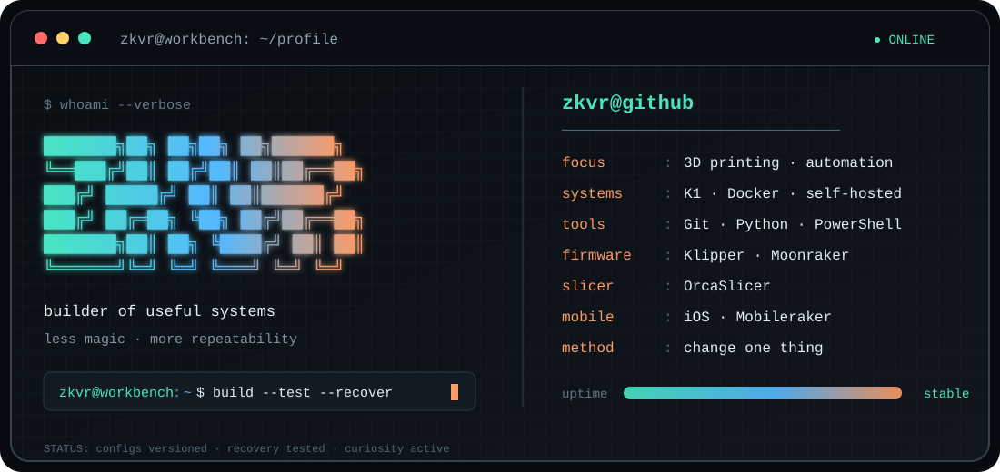

<!--
  PROFILE EDITING
  The visible card is stored in terminal.svg.
  Edit it here:
  https://github.com/Zkvr/Zkvr/edit/main/terminal.svg

  README.md only embeds that SVG on the profile page.
-->

  

